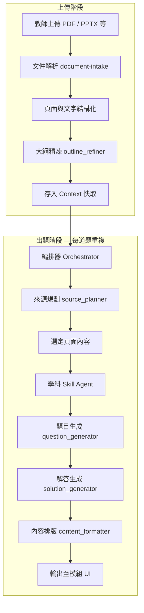

# 出題 Agent 架構說明（技術報告）

**版本**：2026-05  
**適用範圍**：Drills、Labs、Homework、Exams 四個出題模組  
**讀者**：產品、教學設計、技術協作夥伴（不需閱讀程式碼即可理解整體設計）

---

## 1. 摘要

本系統將「從上傳教材到產出一道題目」拆成多個職責清楚的步驟，由一個**編排器（Orchestrator）**依序呼叫多個**專項能力（Agent Skills）**完成。  

核心設計原則有三點：

1. **教材先結構化**：PDF / PPTX 等檔案先轉成統一格式（含頁面、章節、大綱），後續步驟都建立在同一份結構上，避免重複解析。
2. **出題範圍先規劃、再出題**：系統先決定「這一題要用哪些章節、哪些頁」，再讓模型只根據選定內容出題，減少離題與範圍過大。
3. **學科知識外置為 Skill 套件**：程式、語言、財務等學科的出題邏輯、範例與排版規則放在 `.skills/subject-*` 資料夾，用**漸進式揭露（Progressive Disclosure）**按需載入，而不是寫死在單一 prompt 裡。

---

## 2. 整體流程（高層）



**上傳階段**盡量多做「一次做完、全程重用」的工作（解析、大綱）。  
**出題階段**則針對每一題，重複「規劃範圍 → 選學科與題型規則 → 出題 → 出解答 → 排版」。

---

## 3. 各階段說明

### 3.1 文件輸入與統一格式（Document Intake）

| 項目 | 說明 |
|------|------|
| **做什麼** | 把 PDF、PPTX、DOCX 等轉成同一種資料結構：全文、分頁文字、警告訊息等。 |
| **為什麼** | 各模組（Drills、講義彩排等）共用同一套輸入，不必每個功能各自解析檔案。 |
| **產出** | `ContextFile.intake`：含 `pages`、`content`、`metadata` 等，存在前端狀態與後端請求中。 |

教師上傳後，系統依副檔名選擇對應解析方式（非由模型「猜」要用哪種 parser）。

---

### 3.2 大綱產生（Outline，上傳時可預先完成）

| 項目 | 說明 |
|------|------|
| **做什麼** | 將投影片/頁面整理成**章（Chapter）**與**節（Section）**，並標記哪些區塊適合出題。 |
| **步驟** | ① 規則化粗大綱（document_preprocessor）→ ② 模型精煉語意與標題（outline_refiner） |
| **快取** | 精煉後大綱寫入 `intake.metadata.refinedOutline`，之後出題直接重用，不必每次重跑。 |
| **多檔案** | 多份教材時，再以 global_outline_merger 合併成課程級大綱（`course-ch1`、`course-ch2`…）。 |

大綱是後續「這題要跨幾章、選哪幾節」的依據。

---

### 3.3 來源規劃（Source Planning）

在真正出題前，系統先為**每一題**決定題目素材範圍：

| 模組 | 規劃邏輯（概念） |
|------|------------------|
| **Drills 課堂練習** | 單一 Section，範圍小、節奏快。 |
| **Labs 實作** | 同章內多個相關 Section，支援動手做。 |
| **Homework 作業** | 跨兩章，需有章節橋接或整合。 |
| **Exams 考試** | 三章以上概念融合，偏重綜合應用。 |

實作上由 `source_planner`（模型）在預處理後的頁面與大綱上產出計畫；程式端會**核對**計畫中的章節是否與實際選中的頁面一致，不一致時以實際頁面為準修正，避免「宣稱跨章但只選到單檔單頁」。

產出包含：檔名、頁碼、章節 ID、整合目標等，作為出題時的**硬性邊界**。

---

### 3.4 學科 Skill Agent（Progressive Disclosure）

這是本次架構中，負責「這題該用哪種學科思維、什麼格式」的子系統。  
**不再使用獨立的學科偵測器**；改在**每次出題**時，由題目生成流程內完成。

#### 學科 Skill 套件位置

```
.skills/
├── subject-computer-science/   # 程式、演算法、軟工
├── subject-language/           # 語言、閱讀、翻譯、文法
├── subject-finance/            # 財務、會計、估值
├── subject-mathematics/        # 數學、代數、幾何、微積分、統計
├── subject-physics/            # 物理、力學、電磁、熱力
├── subject-chemistry/          # 化學、反應、莫耳、平衡
├── subject-biology/            # 生物、實驗、遺傳、生態
├── subject-history/            # 歷史、史料、時序
├── subject-geography/          # 地理、人文／自然、空間資料
├── subject-civics/             # 公民、社會、政治、法律
└── subject-default/            # 無法明確歸類時的通用規則
```

每個套件通常包含：

| 檔案類型 | 角色 | 是否由模型閱讀 |
|----------|------|----------------|
| `SKILL.md` 的 **metadata**（檔頭 name、description） | 讓路由判斷「像哪一科」 | 是（僅摘要） |
| `SKILL.md` **正文** | 該科出題流程與禁忌 | 選定學科後載入 |
| `references/*.md` | 題型規範、範例、領域框架 | 依題型載入 1～3 份 |
| `scripts/format-question.ts` | 題目 Markdown 的確定性排版 | **否**（程式執行） |
| `profile.json` | 與 runtime 對接的機器可讀設定 | 程式讀取 |

#### 四層漸進式揭露

```
L1  Metadata（所有 subject-* 的 name + description）
         ↓  路由：依本次題目的教材摘選，選一個學科 + 要載入的 reference 檔名
L2  SKILL.md 正文（僅選中的學科）
         ↓
L3  references/*.md（如 coding.md、reading-comprehension.md）
         ↓  模型依此出題
L4  scripts/format-question.ts（出題後由程式排版，不讓模型「猜」格式）
```

**設計用意**：  
- 不一次把所有學科長文塞進 prompt，節省成本、減少干擾。  
- 排版、章節標題等**可規則化**的步驟交給 script，提高畫面一致性。  
- 新增學科時，主要新增資料夾與文件，而非改動核心出題程式。

---

### 3.5 題目生成（Question Generator）

| 項目 | 說明 |
|------|------|
| **輸入** | 來源規劃選定的頁面文字、題型、難度、模組（drills/labs…）、學科 Skill 套件載入的規則與 reference。 |
| **輸出** | 結構化 JSON：題幹、題型、來源頁碼、metadata（如程式題的輸入輸出約定）等。 |
| **約束** | 必須基於 Context 內容，不得憑空出通用題；須符合該學科 reference 中的段落結構（如 CS 的 Task/Inputs/Output）。 |

出題後會立刻執行該學科的 `format-question` script，將題幹轉成標準 Markdown 區塊。

---

### 3.6 解答生成（Solution Generator）

依題型產生解答與簡要說明。選擇題可在程式端用答案鍵直接組裝部分欄位，其餘題型由模型生成，並受題目與來源規劃約束。

---

### 3.7 內容排版與模組輸出（Content Formatter）

| 項目 | 說明 |
|------|------|
| **做什麼** | 將題目、解答、選項等轉成各模組 UI 需要的欄位格式。 |
| **學科** | 依題目 metadata 中的 `subject_skill_id` 再次套用對應 format script，與顯示層一致。 |
| **雙語** | 若設定次要語言，可再經翻譯 skill 處理。 |

---

## 4. Agent Skills 一覽（職責分工）

系統將能力拆成多個具名 Skill，由編排器按序呼叫，而非單一巨型 prompt：

| Skill 名稱 | 類別 | 一句話職責 |
|------------|------|------------|
| document_preprocessor | 文件 | 頁面分類、粗大綱、特徵標籤 |
| outline_refiner | 文件 | 大綱語意精煉、questionable 標記 |
| global_outline_merger | 文件 | 多檔合併為課程級章節 |
| source_planner | 規劃 | 依模組決定每題的章節/頁面範圍 |
| question_generator | 出題 | 產生單題 + 學科 Skill 路由與載入 |
| solution_generator | 出題 | 產生解答與解析 |
| content_formatter | 排版 | 模組化欄位與顯示用 Markdown |
| subject_profile_loader | 學科 | 讀取 profile.json（輔助 runtime） |
| quality_checker / bilingual_translator 等 | 增強 | 品質檢查、翻譯等（依設定啟用） |

`.skills/question-scope-planner/` 為**設計文件型** skill，描述規劃原則，與 runtime 的 `source_planner` 對齊。

---

## 5. 什麼由模型決定、什麼由規則保證

| 由模型（LLM）負責 | 由規則／程式保證 |
|-------------------|------------------|
| 大綱標題與章節語意精煉 | 檔案解析、分頁結構 |
| 每題的來源頁與跨章策略（在 planner 提示下） | 頁面與 chapter/section 的對應、計畫與實際頁面一致性校正 |
| 學科路由（在 metadata catalog 下） | reference 檔名必須來自清單、不可虛構 |
| 題幹、選項、解答文字 | 題目 Markdown 區塊結構（format script） |
| 整合多個概念的出題表述 | 模組題數、配分、題型比例（來自使用者設定） |

此分工的目的：**創意與語意交給模型，邊界與格式交給系統**，方便除錯與持續迭代學科套件。

---

## 6. 與「傳統一次大 prompt 出題」的差異

| 傳統做法 | 目前架構 |
|----------|----------|
| 整份講義塞進一個 prompt | 先規劃「這題只看第 3–5 頁」 |
| 題型、格式寫死在程式 | 學科規則放在 `.skills`，可按科擴充 |
| 程式 / 語言 / 財務混用同一套「Task/Inputs」 | 各科 reference 定義自己的段落與範例 |
| 上傳後每次出題都重新解析 | intake + 大綱可快取重用 |
| 單次呼叫完成所有事 | 多步驟可觀測、可替換單一 Skill |

---

## 7. 擴充新學科（營運視角）

若要支援例如「化學」「法律」：

1. 新增資料夾 `.skills/subject-chemistry/`（名稱需為 `subject-` 開頭）。
2. 撰寫 `SKILL.md`（含清楚的 description，供路由使用）。
3. 在 `references/` 下為各題型撰寫規範與範例（如 `lab-calculation.md`）。
4. 提供 `scripts/format-question.ts`（定義標題、列表、是否使用程式碼區塊等）。
5. 在 `lib/llm/agent-skills/subject-skills/format-registry.ts` 註冊該 script（目前為唯一需改動的程式接點）。

其餘出題流程會自動掃描新 skill 的 metadata，無需新增「偵測器」。

---

## 8. 已知限制與後續方向

- **路由成本**：每題會有一次輕量路由呼叫（僅 metadata），再加主要出題呼叫；以換取學科準確度與可維護性。
- **題型清單**：使用者介面若仍只暴露 CS 偏重題型，語言科可能需擴充 UI 上的題型選項（如 cloze、reading_comprehension）。
- **參考文件語言**：reference 目前以英文撰寫為主，可再增加中文教學情境範例。
- **驗證腳本**：尚未全面提供 `validate-question.ts`；可為高風險題型（計算題、選擇題）補充確定性檢查。

---

## 9. 附錄：關鍵資料流名詞

| 名詞 | 含義 |
|------|------|
| **ContextFile.intake** | 單一上傳檔的解析結果與大綱快取 |
| **refinedOutline** | LLM 精煉後的章節樹 |
| **PlannedSourceItem** | 單題的來源規劃（檔名、頁碼、章節、整合目標） |
| **SubjectSkillAgentPack** | 某次出題載入的學科正文 + references + 路由理由 |
| **subject_skill_id** | 寫入題目 metadata，供排版與追蹤使用 |

---

## 10. 相關程式位置（供技術同事查閱）

| 路徑 | 說明 |
|------|------|
| `lib/llm/agent-skills/orchestrator.ts` | 出題編排主流程 |
| `lib/llm/agent-skills/subject-skills/` | 學科 catalog、路由、format registry |
| `lib/llm/agent-skills/skills/question-generator.ts` | 題目生成與學科 pack 整合 |
| `lib/document-intake/` | 統一文件解析 |
| `app/api/refine-outline/` | 上傳時大綱精煉 API |
| `.skills/subject-*/` | 學科知識與排版套件 |

---

*本文件描述系統設計意圖與當前實作對齊之高層架構；若個別 Skill 行為有調整，以程式庫與 `.skills` 目錄為準。*
